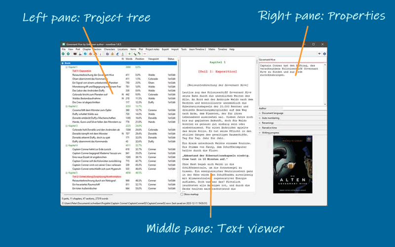

# Desktop overview

The *mdnovel* desktop is divided into three panes:

## Project tree

The project tree in the left pane shows the organization of the project.

-   The tree elements are color-coded according to the section type (see
    [Basic concepts](basic_concepts#part-chapter-section-types)).
    *Normal* type sections are highlighted according to the selected
    coloring mode (see *Options* in the 
    [View menu](view_menu#coloring-mode)).
-   The order of the columns can be changed (see *Options* in the 
    [View menu](view_menu#columns)).
-   Right-clicking on a tree element opens a 
    [context menu](tree_context_menu) with several options.
-   The type of chapters and sections, as well as the completion status
    of the sections are color coded and can be changed via context menu.

### Project tree structure

-   The **Book** branch contains the parts, chapters, and sections that
    belong to the novel manuscript.
-   The **Characters/Locations/Items** branches contain descriptions of
    the story world's elements that can be associated with the book's
    sections.
-   The **Plot lines** branch contains the
    [plot lines and plot points](plotting#defining-plot-lines).
-   The **Project notes** branch contains 
    [project notes](project_note_view).

### Project tree operation

Browsing the tree

:   *mdnovel* has a browsing history for the selected tree elements.
    This allows you to go back and forth e.g. between a section and its
    related characters.

    -    selects a node back in the tree
        browsing history.
    -    selects a node forward in
        the tree browsing history.

    ---
    
    **Hint**

    On Windows, the \"Forward\" and \"Back\" mouse buttons (if any) may
    also work.
    
    ---

#### Move tree elements

Drag and drop while holding down the `Alt` key.

---

**Hint**

With some Linux desktops, it may be necessary to first press the mouse
button, then the `Alt` key.

---

::: caution
::: title
Caution
:::

Be aware, there is no \"Undo\" feature.
:::

#### Delete tree elements

Select the element to delete and hit the `Del` key.

-   Parts and chapters are deleted.
-   Sections are marked \"unused\" and moved to the \"Trash\" chapter.
-   Deleting a part has no effect on its subordinate chapters.
-   Deleting a chapter moves its sections to the \"Trash\" chapter.
-   The \"Trash\" chapter is created automatically, if needed.
-   When deleting the \"Trash\" chapter, all its sections are deleted.

## Text viewer

The **Text viewer** in the middle pane shows the part/chapter/section
contents with their titles as headings.

-   You can open or close the middle pane with the Text viewer with
    **View \> Toggle Text viewer**, or `Ctrl`-`T`, or clicking on
    .
-   On opening, the text viewer shows the text where the tree is
    selected.
-   When changing the tree selection, the text moves along.
-   However, the text can be scrolled independently with the vertical
    scrollbar, or the mousewheel.
-   You can select text with the mouse, and copy it to the clipboard
    with `Ctrl`-`C`.
-   You cannot edit the text in the viewer. For this, the 
    [section editor](editor) is intended.
-   Section text is color-coded according to the section type (see
    [Basic concepts](basic_concepts#part-chapter-section-types)).
-   With the **Show markup** checkbox, XML markup can be shown/hidden.

## Properties

The [Properties](properties) in the right pane show properties and
metadata of the element selected in the project tree.

-   The project settings can be made in the *Book* properties view.
-   You can open or close the element properties window with **View \>
    Toggle Properties** or `Ctrl`-`Alt`-`T`, or clicking on .
-   On opening, the windows shows the editable properties of the
    selected element.
-   You can detach or dock the element properties window with **View \>
    Detach/Dock Properties** or `Ctrl`-`Alt`-`D`.
-   On closing the detached window, the properties are docked again.

## Menu bar

The bar at the top is the menu bar with the main menu, which is
documented in the [Command reference](command_reference).

## Toolbar

The second bar from the top is the toolbar with [buttons for frequently
used actions](toolbar).

## Status bar

The second bar from the bottom is the status bar. It normally displays
project statistics, such as word count. These are overwritten with
program messages when necessary.

-   Messages on a green background indicate successful actions.
-   Messages on a red background indicate errors or warnings.

---

**Tip**

You can restore the normal view at any time by clicking on the status
bar.

---

## Footer bar

The footer bar at the bottom displays the project file path and the file
date.

Change notification

:   If there are unsaved changes, the footer bar is highlighted in
    goldenrod.

